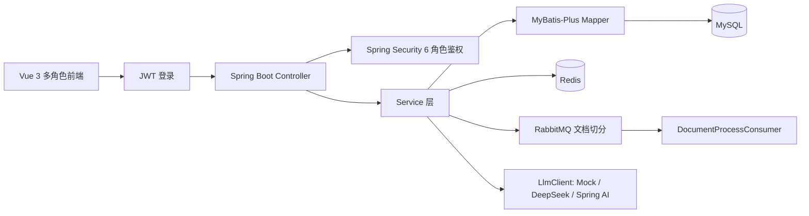
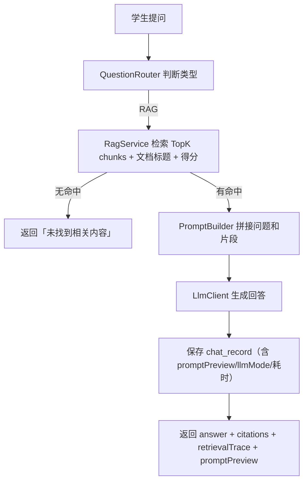

# Campus Knowledge Hub — 校园知识库智能问答平台

📌 **产品定位**：面向高校课程资料、复习笔记和实验文档的多角色知识库问答平台。教师上传资料 → 系统异步解析 → 学生基于资料提问 → 答案溯源 → 管理员监控。

不再是"AI 问答 Demo"，而是一个真实的多角色校园知识库产品。

## 角色

| 角色 | 核心目标 | 演示账号 |
|------|---------|---------|
| 🧑‍🎓 学生 | 快速基于课程资料获得可靠答案 | student / 123456 |
| 👨‍🏫 教师 | 建设和维护课程知识库 | teacher / 123456 |
| 🛡️ 管理员 | 维护系统运行和全局数据 | admin / 123456 |

## 技术栈

- **后端**：Java 21、Spring Boot 3.3.5、Spring Security 6 + JWT + BCrypt
- **AI**：LlmClient 抽象 → MockLlmClient / DeepSeekLlmClient / SpringAiChatClientLlmClient
- **ORM**：MyBatis-Plus 3.5.9
- **数据**：MySQL 8.0、Redis 7
- **消息队列**：RabbitMQ 3（文档异步切分）
- **前端**：Vue 3、Vue Router、Element Plus、Vite、Axios
- **文档**：SpringDoc OpenAPI 2.6

## 架构图



## RAG 流程图



## 快速启动

```powershell
# 1. 启动基础设施（MySQL/Redis/RabbitMQ）
docker compose up -d

# 2. 启动后端
mvn spring-boot:run

# 3. 启动前端（另一个终端）
cd frontend
npm install
npm run dev
```

地址：
- 前端：http://localhost:5173
- 后端 Swagger：http://localhost:8081/swagger-ui.html
- RabbitMQ 管理台：http://localhost:15672（guest/guest）

## 演示流程

见 `docs/demo-script.md`，完整的面试演示脚本（教师上传 → 学生提问 → 管理员监控）。

## 接口概览

完整接口见 `docs/api.md`。

```powershell
# 登录
curl -X POST http://localhost:8081/api/auth/login -H "Content-Type: application/json" -d "{\"username\":\"student\",\"password\":\"123456\"}"

# 学生首页
curl http://localhost:8081/api/student/dashboard -H "Authorization: Bearer <token>"

# 提问（RAG 可解释问答）
curl -X POST http://localhost:8081/api/chat/ask -H "Content-Type: application/json" -H "Authorization: Bearer <token>" -d "{\"knowledgeBaseId\":1,\"question\":\"Java 集合怎么复习\"}"
```

## 面试重点

1. **为什么多角色？** 学生消费知识，教师维护资料，管理员关注系统状态。
2. **为什么用 RabbitMQ？** 上传不阻塞，异步切分并展示状态流转（PROCESSING → DONE/FAILED）。
3. **为什么返回引用来源？** 知识库问答需要可核查依据，答案溯源提升可信度。
4. **为什么无命中不调用模型？** 防止模型在没有资料的领域胡编，是 AI 应用可靠性的关键边界。
5. **Redis 缓存什么？** 知识库列表、FAQ、会话上下文，失败降级到 MySQL/主流程。
