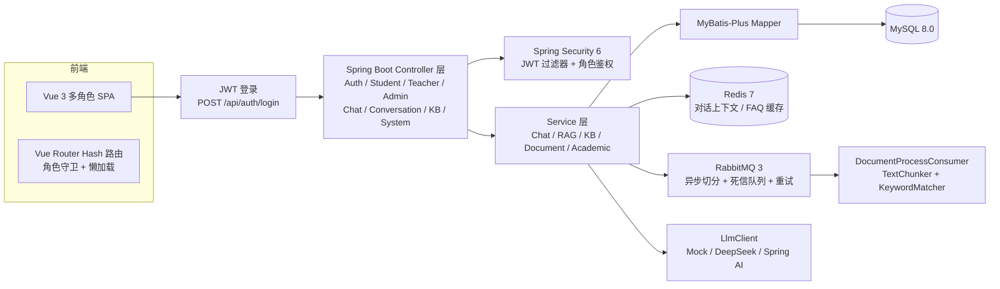
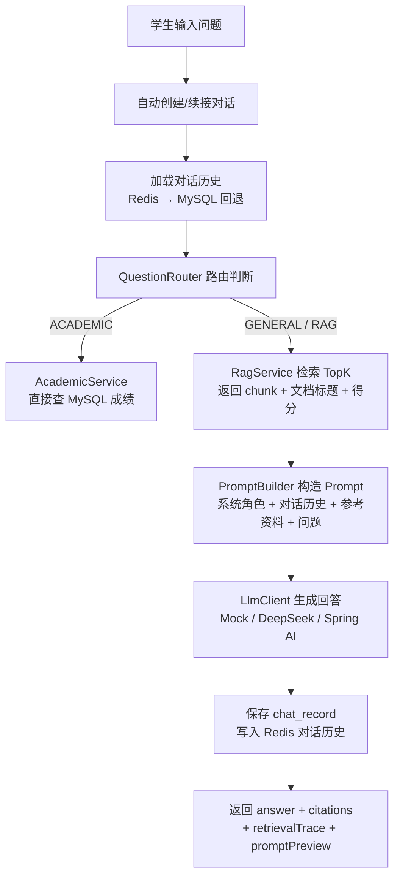

# Campus Knowledge Hub — 校园知识库智能问答平台

📌 **产品定位**：面向高校课程资料、复习笔记和实验文档的多角色知识库问答平台。教师上传资料 → 系统异步解析 → 学生基于资料提问 → 对话式 AI 问答 → 答案溯源 → 管理员全局监控。

不再是"AI 问答 Demo"，而是一个真实的多角色校园知识库产品。

## 角色

| 角色 | 核心目标 | 演示账号 |
|------|---------|---------|
| 🧑‍🎓 学生 | 基于课程资料获得可靠答案，支持多轮对话 | student / 123456 |
| 👨‍🏫 教师 | 建设和维护课程知识库，上传多种格式资料 | teacher / 123456 |
| 🛡️ 管理员 | 全局用户管理、知识库审计、系统状态监控 | admin / 123456 |

## 核心功能

- **多轮对话**：基于对话（Conversation）的上下文记忆，支持对话切换和历史回溯
- **知识库管理**：创建/编辑/删除知识库，支持 PUBLIC / PRIVATE / COURSE_ONLY 可见性
- **多格式上传**：支持 TXT、Markdown、PDF（PDFBox）、Word（POI）文件的文本提取与分块
- **RAG 智能问答**：关键词检索 TopK 片段作为参考资料，LLM 综合上下文生成回答
- **答案溯源**：返回引用来源（文档标题、片段序号、匹配得分），答案可核查
- **对话记忆**：Redis 热存储 + MySQL 持久化双写，24 小时 TTL，自动回退查询
- **学业查询**：JWT 自动识别学生身份，展示成绩明细、平均分、总学分
- **异步处理**：RabbitMQ 纯异步文档切分 + 死信队列（DLQ）+ 指数退避重试（3 次），前端轮询处理进度
- **多角色鉴权**：Spring Security 6 + JWT + BCrypt，角色级路由守卫
- **管理员全量 CRUD**：用户创建/编辑/删除/启停，支持学生表同步

## 技术栈

- **后端**：Java 21、Spring Boot 3.3.5、Spring Security 6 + JWT + BCrypt
- **AI**：LlmClient 抽象 → MockLlmClient / DeepSeekLlmClient / SpringAiChatClientLlmClient
- **ORM**：MyBatis-Plus 3.5.9
- **数据**：MySQL 8.0、Redis 7（对话上下文缓存、FAQ 缓存）
- **消息队列**：RabbitMQ 3（纯异步文档切分 + 死信队列 + RetryInterceptor 重试，Jackson JSON 序列化）
- **文档解析**：PDFBox 3.0.3（PDF）、Apache POI 5.3.0（Word/docx）
- **前端**：Vue 3、Vue Router（Hash 路由 + 懒加载）、Element Plus、Vite、Axios
- **API 文档**：SpringDoc OpenAPI 2.6
- **数据库迁移**：DataInitializer 启动自动建表/加列/初始化演示账号

## 系统架构



## 对话式 RAG 问答流程



**关键设计决策**：
- RAG 检索结果作为**参考资料**而非唯一答案来源，LLM 始终被调用并可使用自身知识补充
- 对话历史以 Q&A 对存储在 Redis List 中（24h TTL），同时落库 MySQL 持久化
- 无对话时自动创建，对话标题取自首条问题前 30 字

## 数据库表

| 表 | 说明 | 关键字段 |
|----|------|---------|
| `sys_user` | 用户表 | username, password(bcrypt), role(STUDENT/TEACHER/ADMIN), status(ENABLED/DISABLED) |
| `student` | 学生信息 | user_id(关联sys_user), student_no, name, major, grade |
| `course` | 课程表 | course_name, course_code, credit |
| `score` | 成绩表 | student_id, course_id, score, semester |
| `kb_knowledge_base` | 知识库 | name, description, owner_id, visibility, document_count, chunk_count |
| `kb_document` | 文档 | file_name, file_type, file_size, status(PROCESSING/DONE/FAILED), chunk_count |
| `kb_document_chunk` | 文档片段 | chunk_index, content, keywords |
| `chat_conversation` | 对话 | user_id, title, knowledge_base_id |
| `chat_record` | 问答记录 | conversation_id, user_id, question, answer, source_type, matched_chunk_ids, llm_mode, 耗时 |

## 快速启动

```powershell
# 1. 启动基础设施（MySQL 需本地安装，Redis + RabbitMQ 走 Docker）
.\start-infra.bat

# 2. 启动后端（自动建表 + 初始化演示账号）
mvn spring-boot:run

# 3. 启动前端（另一个终端）
cd frontend
npm install
npm run dev
```

地址：
- 前端：http://localhost:5173
- 后端 Swagger：http://localhost:8081/swagger-ui.html
- RabbitMQ 管理台：http://localhost:15672（guest/guest）

## 演示流程

见 `docs/demo-script.md`，完整的面试演示脚本（教师上传 PDF/Word → 异步处理 → 学生多轮对话 → 对话切换 → 学业查询 → 管理员用户 CRUD → 系统监控）。

## 接口概览

完整接口见 `docs/api.md`。

```powershell
# 登录（获取 JWT Token）
curl -X POST http://localhost:8081/api/auth/login \
  -H "Content-Type: application/json" \
  -d '{"username":"student","password":"123456"}'

# 学生首页（需 Token）
curl http://localhost:8081/api/student/dashboard \
  -H "Authorization: Bearer <token>"

# 创建对话
curl -X POST http://localhost:8081/api/conversations \
  -H "Content-Type: application/json" \
  -H "Authorization: Bearer <token>" \
  -d '{"title":"Java 学习"}'

# 对话式提问（自动记忆上下文）
curl -X POST http://localhost:8081/api/chat/ask \
  -H "Content-Type: application/json" \
  -H "Authorization: Bearer <token>" \
  -d '{"conversationId":1,"knowledgeBaseId":1,"question":"Java 集合怎么复习？"}'

# 管理员创建用户
curl -X POST http://localhost:8081/api/admin/users \
  -H "Content-Type: application/json" \
  -H "Authorization: Bearer <admin-token>" \
  -d '{"username":"newstudent","password":"123456","role":"STUDENT","nickname":"新同学"}'
```

## 面试重点

1. **为什么多角色？** 学生消费知识，教师维护资料，管理员关注系统状态。真实校园产品需要不同的功能边界和权限隔离。
2. **为什么用 RabbitMQ？** 上传接口投递消息后立即返回，Consumer 异步切分。配置 RetryInterceptor（3 次指数退避）+ 死信队列（DLQ），重试耗尽后自动标记 FAILED。Jackson JSON 序列化避免反序列化安全问题。
3. **为什么做对话记忆？** 多轮对话需要上下文连续性。Redis List 存储最近 10 轮（20 条），24h TTL 热数据，降级到 MySQL 持久化。主流企业方案：Redis 热缓存 + DB 持久化双写。
4. **RAG 为什么作为参考而非权威？** 关键词匹配可能遗漏，LLM 综合能力更强。检索结果作为参考资料注入 Prompt，LLM 可结合自身知识补充回答，避免"生硬拼接"。
5. **为什么返回引用来源？** 知识库问答需要可核查依据，答案溯源提升可信度，面试可展示 RAG 可解释性闭环。
6. **Redis 缓存什么？** 对话上下文（List, 24h）、FAQ 缓存（String, 30min）、知识库列表。设置 TTL，失败降级到 MySQL。
7. **为什么用 DataInitializer？** 启动时自动建表、加列、初始化演示账号和 BCrypt 密码，无需手动执行 SQL 脚本，降低演示部署成本。
8. **学业查询为什么不走大模型？** 成绩是确定性结构化数据，直接查 MySQL 保证精度，防止模型编造分数。
