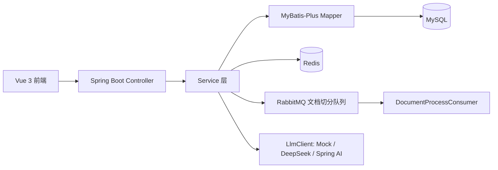
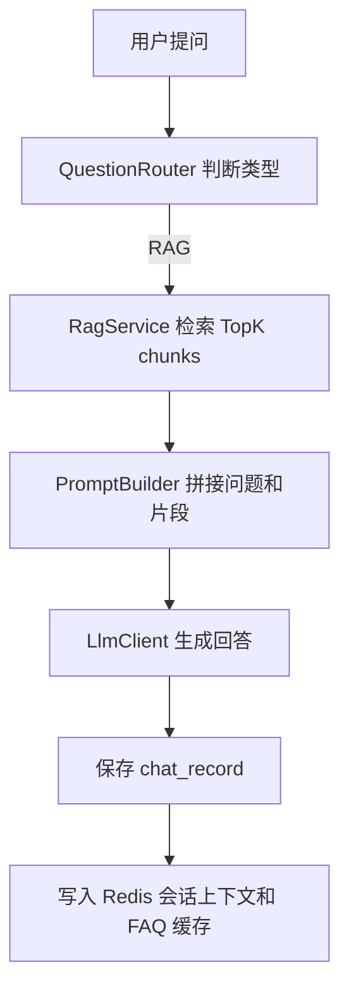

# campus-ai-assistant

校园资料智能问答与学业助手系统是一个个人学习、复现与二次开发项目，用 Spring Boot 实现知识库录入、文本切分、关键词 TopK 检索、Prompt 拼接、Mock/DeepSeek/Spring AI ChatClient 可替换调用、聊天记录保存、学业成绩查询，并补充 Vue 3 前端演示。

## 技术栈

- 后端：Java 21、Spring Boot 3、MyBatis-Plus、Spring Web、Validation、SpringDoc OpenAPI
- AI：`LlmClient` 抽象、`MockLlmClient`、`DeepSeekLlmClient`、`SpringAiChatClientLlmClient`
- 数据：MySQL、Redis
- 消息队列：RabbitMQ，用于文档异步切分示例
- 前端：Vue 3、Vite、Element Plus、Axios

## 功能列表

- 知识库创建、列表、详情、删除
- 文档录入、同步切分、RabbitMQ 异步切分
- chunk 查询、关键词 TopK 检索
- `QuestionRouter` 区分 RAG、学业查询、通用问题
- `PromptBuilder` 构造 RAG Prompt 和通用 Prompt
- `/api/chat/ask` 返回答案、命中片段和 promptPreview
- Redis 缓存知识库列表、高频问答、会话上下文
- 学生课程成绩查询、课程平均分查询

## 架构图



## RAG 流程图



## 数据库表

- `kb_knowledge_base`：知识库
- `kb_document`：文档
- `kb_document_chunk`：文档切分片段
- `chat_record`：聊天记录
- `student`：学生
- `course`：课程
- `score`：成绩

SQL 字段使用下划线，Java Entity 使用驼峰命名，MyBatis-Plus 开启 `map-underscore-to-camel-case`。

## 快速启动

```powershell
docker compose up -d
mvn spring-boot:run
```

前端：

```powershell
cd frontend
npm install
npm run dev
```

地址：

- 后端：http://localhost:8081
- 前端：http://localhost:5173
- Swagger：http://localhost:8081/swagger-ui.html
- RabbitMQ 管理台：http://localhost:15672，账号密码 `guest/guest`

## 本地 MySQL / Redis / RabbitMQ

`docker-compose.yml` 提供 MySQL、Redis、RabbitMQ。也可以本机自行启动后通过环境变量覆盖：

```powershell
$env:MYSQL_URL="jdbc:mysql://localhost:3306/campus_ai?useUnicode=true&characterEncoding=utf8&serverTimezone=Asia/Shanghai&useSSL=false&allowPublicKeyRetrieval=true"
$env:REDIS_HOST="localhost"
$env:RABBITMQ_HOST="localhost"
```

## mock / real / spring-ai 模式

默认 `llm.mode=mock`，没有 DeepSeek Key 也能启动和演示。`llm.mode=real` 使用 `DeepSeekLlmClient`，缺少 `DEEPSEEK_API_KEY` 时只在调用真实模型时报明确错误。`llm.mode=spring-ai` 使用 `SpringAiChatClientLlmClient`，配置复用 `spring.ai.openai.*`。

## 接口示例

```powershell
curl http://localhost:8081/api/health
curl -X POST http://localhost:8081/api/kb -H "Content-Type: application/json" -d "{\"name\":\"Java复习\",\"description\":\"面试资料\"}"
curl -X POST http://localhost:8081/api/chat/ask -H "Content-Type: application/json" -d "{\"userId\":1,\"knowledgeBaseId\":1,\"question\":\"Java 集合怎么复习\"}"
```

完整接口见 `docs/api.md`。

## 面试讲解重点

重点讲清楚文本如何切分、如何做关键词检索、Prompt 怎么拼、LLM 客户端如何替换、Redis 缓存失败为什么不影响主链路、RabbitMQ 在文档切分中如何做异步化。

## 简历写法

建议写成“个人学习、复现与二次开发项目”，强调 Spring Boot、MyBatis-Plus、MySQL、Redis、RabbitMQ、RAG、Prompt、大模型 API，不写高并发、分布式、微服务。

## 参考项目与致谢

参考了常见知识库问答、校园助手和 Spring Boot 后端项目的公开学习思路，并结合实习简历场景做了二次开发。
