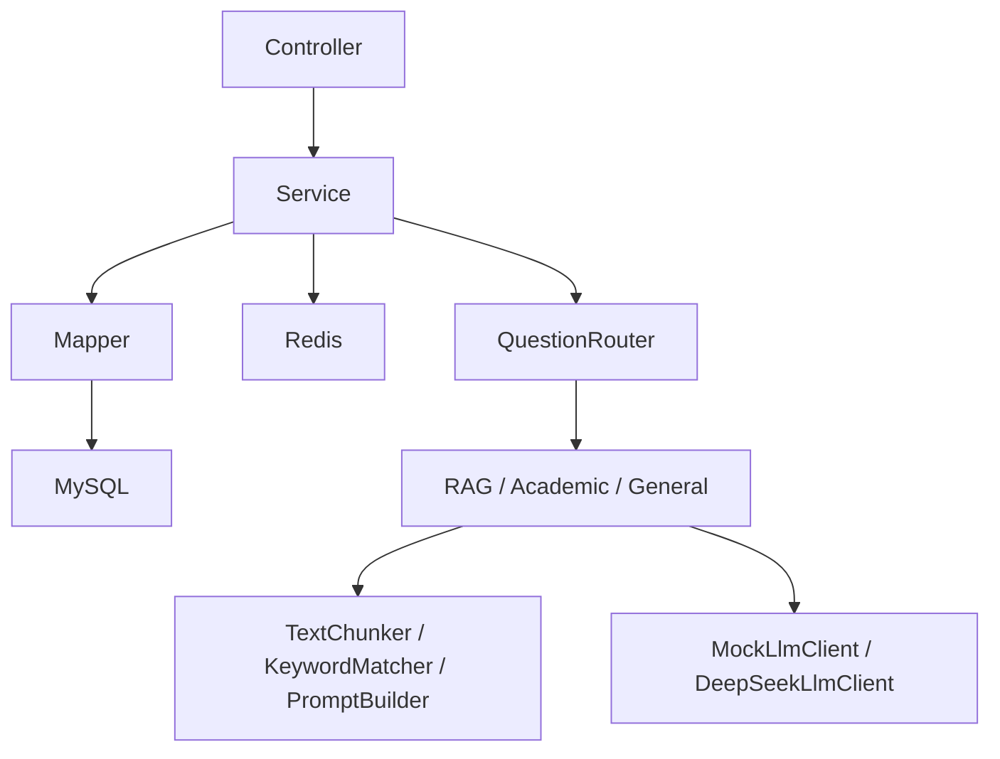
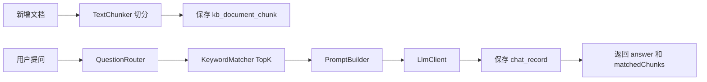

# 校园资料智能问答与学业助手系统

## 项目简介

`campus-ai-assistant` 是一个面向 AI 应用开发实习、智能体开发实习和 Java 后端实习的个人学习、复现与二次开发项目。项目实现了知识库创建、文档录入、文本切分、关键词 TopK 检索、Prompt 构建、Mock/DeepSeek LLM 调用、聊天记录保存和学业成绩查询。

## 技术栈

- Java 21
- Spring Boot 3.x
- MyBatis-Plus
- MySQL 8
- Redis
- springdoc-openapi
- Lombok
- 自定义 `LlmClient`
- Prompt + 简化 RAG

## 功能列表

- 知识库创建、列表、详情、删除
- 文档录入、文本切分、chunk 查询、文档删除
- `QuestionRouter` 问题路由：RAG、学业查询、普通问答
- `TextChunker` 文本切分
- `KeywordMatcher` 关键词 TopK 检索
- `PromptBuilder` 构建结构化 Prompt
- `MockLlmClient` 默认模拟回答
- `DeepSeekLlmClient` 预留真实调用
- 学生课程成绩查询、课程平均分查询
- Redis 会话上下文缓存、FAQ 缓存

## 项目架构图



## RAG 流程图



## 数据库表说明

- `kb_knowledge_base`：知识库
- `kb_document`：文档原文
- `kb_document_chunk`：文档片段
- `chat_record`：问答记录
- `student`：学生
- `course`：课程
- `score`：成绩

SQL 字段使用下划线，Java Entity 使用驼峰，MyBatis-Plus 开启 `map-underscore-to-camel-case`。

## 快速启动步骤

```powershell
cd resume-projects/campus-ai-assistant
mysql -uroot -proot < scripts/init.sql
mysql -uroot -proot < scripts/sample-data.sql
mvn spring-boot:run
```

## 本地 MySQL/Redis 启动方式

MySQL 默认配置：

- URL：`jdbc:mysql://localhost:3306/campus_ai`
- 用户名：`root`
- 密码：`root`

Redis 默认配置：

- host：`localhost`
- port：`6379`

Redis 不可用时，聊天主流程仍可执行，但会跳过会话上下文和 FAQ 缓存。

## Docker Compose 可选启动方式

```powershell
docker compose up -d
```

如果使用 Docker Compose，请确认本机已安装 Docker。当前仓库不依赖 Docker 才能编译。

## Swagger 地址

- `http://localhost:8081/swagger-ui/index.html`

## 接口示例

创建知识库：

```json
{
  "name": "Java 复习资料库",
  "description": "Java 基础知识资料"
}
```

新增文档：

```json
{
  "title": "Java 集合基础",
  "content": "ArrayList 底层基于动态数组，HashMap 使用哈希表保存键值对..."
}
```

AI 提问：

```json
{
  "userId": 1,
  "question": "帮我解释 Java 集合怎么复习",
  "knowledgeBaseId": 1
}
```

## mock 模式和 real 模式

默认配置为 mock：

```yaml
llm:
  mode: mock
  api-key: ${DEEPSEEK_API_KEY:}
```

- `mock`：走 `MockLlmClient`，无 API Key 也能运行。
- `real`：走 `DeepSeekLlmClient`，调用时需要 `DEEPSEEK_API_KEY`。
- real 模式缺少 API Key 时，项目启动不报错，只在调用模型时返回明确错误。

## 面试讲解重点

- 为什么先做关键词检索版 RAG，而不是上向量数据库。
- 为什么成绩查询要查 MySQL，而不是交给模型编造。
- `LlmClient` 抽象如何支持 mock 和真实模型切换。
- Redis 为什么只缓存会话上下文和高频问答，不缓存所有回答。
- SQL 下划线和 Java 驼峰如何映射。

## 简历写法

建议写成“基于 Spring Boot 的校园资料智能问答项目”，强调接口开发、数据库设计、简化 RAG、Prompt 构造、大模型 API 接入和 Redis 缓存。不要写复杂 Agent、向量数据库或生产级知识库系统。

## 参考项目与致谢

参考 [kszapsza/spring-ai-rag](https://github.com/kszapsza/spring-ai-rag) 的 Spring Boot、RAG 和大模型应用组织思路。本项目为个人学习、复现与二次开发项目，不将参考项目表述为完全原创。
