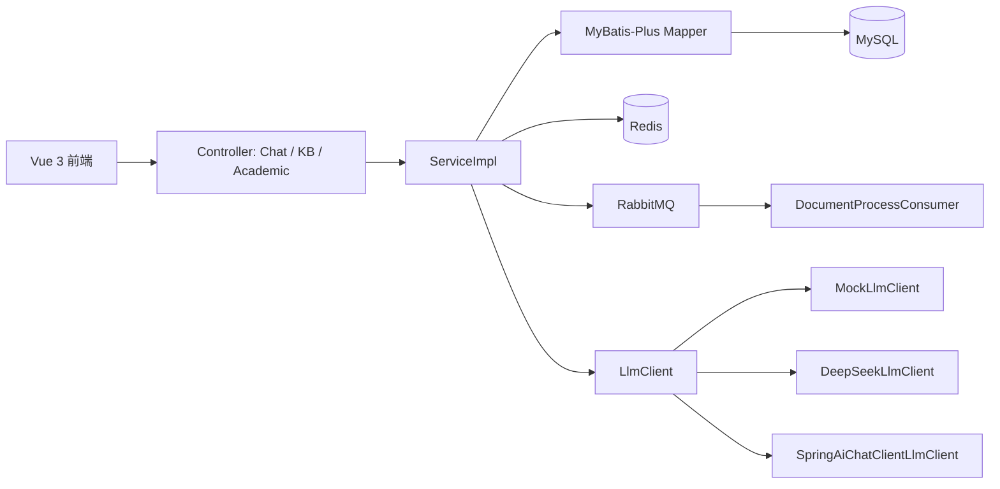

# 架构说明

## 分层

- Controller：接口入口，路径见 `docs/api.md`。
- Service：知识库、RAG、聊天、学业查询主流程。
- Mapper/Entity：对应 MySQL 表，字段下划线到驼峰。
- Redis：缓存知识库列表、高频问答、会话上下文。
- RabbitMQ：`POST /api/kb/{knowledgeBaseId}/document/upload` 提交文档切分消息。
- LLM：通过 `LlmClient` 抽象，默认 mock，可切换 DeepSeek 或 Spring AI ChatClient。

## 关键代码

- `src/main/java/com/liminghan/campusai/controller/ChatController.java`
- `src/main/java/com/liminghan/campusai/service/impl/ChatServiceImpl.java`
- `src/main/java/com/liminghan/campusai/service/impl/RagServiceImpl.java`
- `src/main/java/com/liminghan/campusai/service/impl/KnowledgeBaseServiceImpl.java`
- `src/main/java/com/liminghan/campusai/mq/DocumentProcessConsumer.java`
