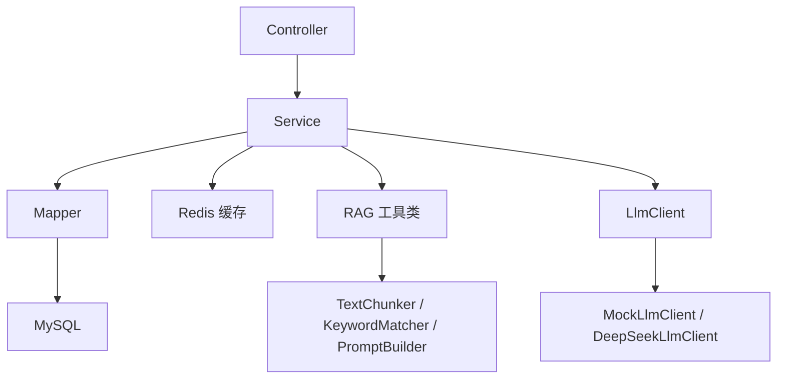

# 架构说明

当前项目采用单体 Spring Boot 分层结构。

## 分层

- `controller`：健康检查、知识库、聊天、学业查询接口
- `service`：业务接口、问题路由、LLM 抽象
- `service.impl`：知识库、RAG、聊天、学业查询、Mock/DeepSeek 实现
- `mapper`：MyBatis-Plus 数据访问
- `entity`：数据库表映射
- `dto`：请求参数
- `vo`：返回对象
- `util`：文本切分、关键词匹配、Prompt 构造
