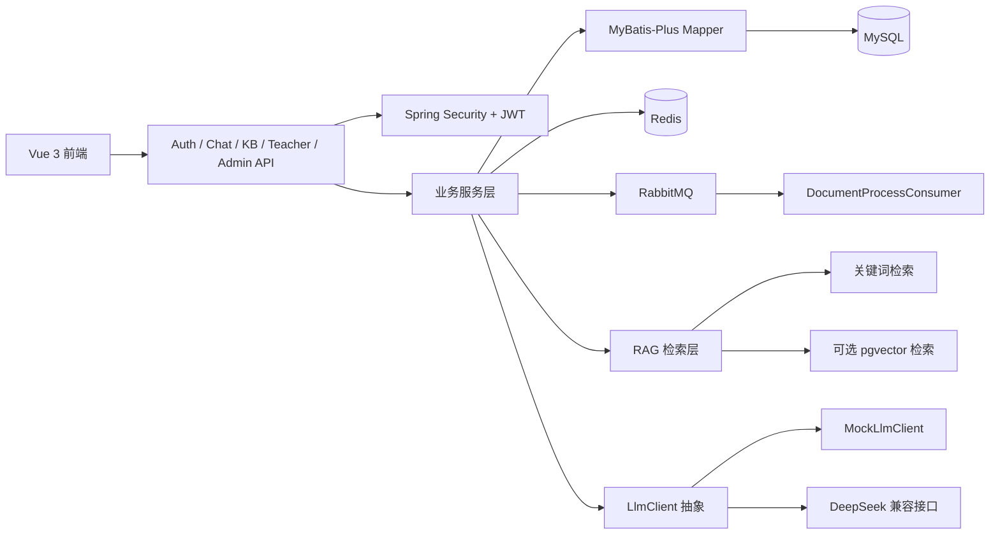

# 架构说明

本文档说明项目架构。重点不是罗列技术栈，而是说明每一层解决什么问题，以及关键代码在哪里。

## 总体架构



## 1. 前端层

职责：

- 根据角色展示学生、教师、管理员不同页面。
- 学生端展示问答、引用来源、会话历史。
- 教师端维护知识库和文档。
- 管理员端查看平台状态、用户、文档任务。

关键代码：

- `frontend/src/views/ChatWorkspace.vue`
- `frontend/src/views/DocumentCenter.vue`
- `frontend/src/views/QuestionAnalytics.vue`
- `frontend/src/views/AdminDashboard.vue`
- `frontend/src/views/DocumentTasks.vue`

设计说明：

> 前端不是一个通用聊天框，而是按角色拆成工作台。学生关心答案和引用，教师关心资料维护，管理员关心平台治理。

## 2. 接口与权限层

职责：

- `AuthController` 负责登录。
- `JwtAuthenticationFilter` 从请求头解析 Token。
- `SecurityConfig` 定义接口访问权限。
- Controller 只处理请求入口，具体业务下沉到 Service。

关键代码：

```java
// SecurityConfig.java
.requestMatchers("/api/auth/**").permitAll()
.requestMatchers("/api/student/**").hasAnyAuthority("STUDENT", "ADMIN")
.requestMatchers("/api/teacher/**").hasAnyAuthority("TEACHER", "ADMIN")
.requestMatchers("/api/admin/**").hasAuthority("ADMIN")
```

```java
// JwtAuthenticationFilter.java
Claims claims = jwtUtil.parseClaims(token);
String username = claims.getSubject();
String role = claims.get("role", String.class);
SecurityContextHolder.getContext().setAuthentication(authentication);
```

对应文件：

- `src/main/java/com/liminghan/campusai/security/JwtAuthenticationFilter.java`
- `src/main/java/com/liminghan/campusai/config/SecurityConfig.java`
- `src/main/java/com/liminghan/campusai/service/impl/AuthServiceImpl.java`

## 3. 业务服务层

职责：

- `ChatServiceImpl` 编排问答流程。
- `RagServiceImpl` 负责检索和拒答边界。
- `KnowledgeBaseServiceImpl` 负责知识库、文档、切片和索引。
- `AcademicServiceImpl` 负责确定性学业数据查询。

关键代码：

```java
// ChatServiceImpl.java
QuestionType questionType = questionRouter.route(request.getQuestion());
if (questionType == QuestionType.ACADEMIC_QUERY) {
    return handleAcademicQuery(request);
}
return handleRagQuestion(request);
```

```java
// QuestionRouter.java
if (containsAny(safeQuestion, ACADEMIC_KEYWORDS)) {
    return QuestionType.ACADEMIC_QUERY;
}
if (containsAny(safeQuestion, RAG_KEYWORDS)) {
    return QuestionType.RAG;
}
return QuestionType.GENERAL_CHAT;
```

设计说明：

> 我把不确定生成和确定性业务查询分开。成绩、课程这类数据直接查数据库；资料解释类问题进入 RAG；兜底闲聊才走普通模型回复。

## 4. 数据与缓存层

职责：

- MySQL 保存用户、知识库、文档、知识片段、聊天记录、学业数据。
- Redis 缓存知识库列表、高频问答和会话上下文。
- 初始化脚本提供可复现演示数据。

关键代码：

```java
// ChatServiceImpl.java
String cacheKey = "chat:qa:" + DigestUtils.md5DigestAsHex(question.getBytes(StandardCharsets.UTF_8));
String cachedAnswer = redisTemplate.opsForValue().get(cacheKey);
```

```java
// DataInitializer.java
Resource initSql = new ClassPathResource("db/init.sql");
Resource sampleSql = new ClassPathResource("db/sample-data.sql");
```

对应文件：

- `src/main/java/com/liminghan/campusai/config/DataInitializer.java`
- `src/main/java/com/liminghan/campusai/entity/KbDocumentChunk.java`
- `src/main/java/com/liminghan/campusai/entity/ChatRecord.java`
- `docs/database-design.md`
- `docs/sample-data.md`

## 5. 异步文档处理层

职责：

- 上传接口快速返回。
- 文档处理放到 RabbitMQ 消费者中执行。
- 处理流程包括抽取文本、切片、保存 chunk、建立向量索引、更新状态。

关键代码：

```java
// KnowledgeBaseServiceImpl.java
DocumentProcessMessage message = new DocumentProcessMessage();
message.setDocumentId(documentId);
message.setKnowledgeBaseId(knowledgeBaseId);
rabbitTemplate.convertAndSend(documentExchange, documentRoutingKey, message);
```

```java
// DocumentProcessConsumer.java
@RabbitListener(queues = "${app.mq.document-queue}")
public void consume(DocumentProcessMessage message) {
    knowledgeBaseService.processDocumentChunks(message.getDocumentId());
}
```

对应文件：

- `src/main/java/com/liminghan/campusai/config/RabbitMqConfig.java`
- `src/main/java/com/liminghan/campusai/mq/DocumentProcessConsumer.java`
- `src/main/java/com/liminghan/campusai/service/impl/KnowledgeBaseServiceImpl.java`

## 6. RAG 与模型层

职责：

- 先检索资料，再构造 Prompt。
- 返回答案时带引用片段。
- pgvector 是增强层，关键词检索是可运行兜底。
- `LlmClient` 抽象隔离具体模型供应商。

关键代码：

```java
// RagServiceImpl.java
vectorSearchService.indexChunks(chunks, titleMap);
List<MatchedChunkVO> vectorResults = vectorSearchService.search(knowledgeBaseId, question, topK);
if (!vectorResults.isEmpty()) {
    return vectorResults;
}
return keywordMatcher.topKWithScore(question, chunks, topK, titleMap);
```

```java
// PromptBuilder.java
return """
        你是校园课程智能助教。请只基于给定资料回答。
        如果资料不足，请说明资料中没有明确依据。
        """;
```

对应文件：

- `src/main/java/com/liminghan/campusai/service/impl/RagServiceImpl.java`
- `src/main/java/com/liminghan/campusai/service/PromptBuilder.java`
- `src/main/java/com/liminghan/campusai/service/llm/LlmClient.java`
- `src/main/java/com/liminghan/campusai/service/vector/PgVectorSearchService.java`
- `src/main/java/com/liminghan/campusai/service/vector/HashingEmbeddingService.java`

## 架构边界

- 当前项目是单体应用，不包装成微服务项目。
- 当前 embedding 是可配置接口：默认本地 hashing，配置后可调用 OpenAI-compatible 真实 embedding。
- 样例知识库是可复现资料库，不包装成真实学校生产数据。
- DeepSeek 使用 OpenAI 兼容 Chat 接口，不包含 Speech、Transcription、Image 功能。
