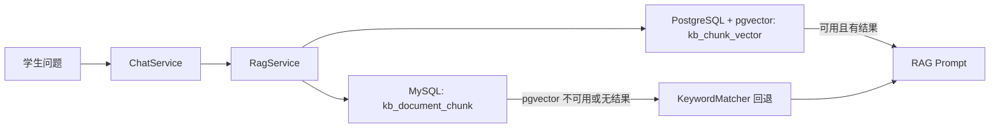

# Phase 2-B PostgreSQL + pgvector 实施设计

## 目标

在不迁移主业务库的前提下，为 Campus Knowledge Hub 增加可选的 pgvector 向量检索层。主业务数据仍保存在 MySQL，PostgreSQL + pgvector 只保存知识片段的向量索引副本。

## 本轮实现范围

- Docker Compose 增加 `pgvector` 服务。
- 后端增加 PostgreSQL JDBC 依赖。
- 新增向量表 `kb_chunk_vector`。
- 使用本地 hashing embedding 将文本转为固定维度向量。
- `RagServiceImpl` 检索时优先尝试 pgvector。
- pgvector 不可用、未启用或无结果时，自动回退现有关键词检索。
- 文档处理完成后可将 chunk 同步到向量索引；首次检索时也会懒同步当前知识库片段。

## 非范围

- 不把 MySQL 主库切换到 PostgreSQL。
- 不接入真实 embedding 模型。
- 不引入 rerank 模型。
- 不承诺语义效果等同真实 embedding。

## 架构



## 配置

默认启用向量检索：

```yaml
app:
  vector:
    enabled: ${VECTOR_SEARCH_ENABLED:true}
    dimension: ${VECTOR_DIMENSION:128}
    jdbc-url: ${VECTOR_DB_URL:jdbc:postgresql://localhost:5433/campus_ai_vector}
    username: ${VECTOR_DB_USERNAME:campus_ai}
    password: ${VECTOR_DB_PASSWORD:campus_ai}
```

如果本地没有启动 pgvector，系统会记录 warn 日志并回退关键词检索。

## 验收标准

- `mvn -q -DskipTests compile` 通过。
- `npm run build` 通过。
- pgvector 不启动时，问答仍可使用关键词检索。
- pgvector 启动时，后端能创建 `kb_chunk_vector` 并写入片段向量。
- README 明确说明当前 embedding 是 hashing embedding，不是真实模型 embedding。

