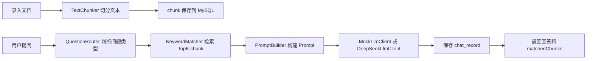

# RAG 流程

当前阶段实现的是简化版 RAG，不引入向量数据库。

```mermaid
flowchart LR
    A["录入文档"] --> B["TextChunker 切分文本"]
    B --> C["chunk 保存到 MySQL"]
    D["用户提问"] --> E["QuestionRouter 判断问题类型"]
    E --> F["KeywordMatcher 检索 TopK chunk"]
    F --> G["PromptBuilder 构建 Prompt"]
    G --> H["MockLlmClient 或 DeepSeekLlmClient"]
    H --> I["保存 chat_record"]
    I --> J["返回回答和 matchedChunks"]
```

后续可将 `KeywordMatcher` 替换为向量检索实现，例如 pgvector、Milvus 或 Chroma。
