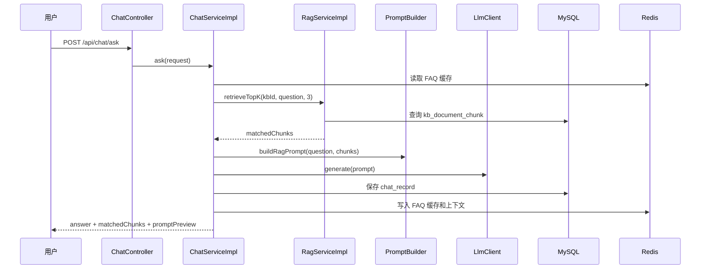

# RAG 流程

当前实现是关键词 TopK 检索，不接向量数据库。这样便于本地运行和面试讲解，后续可以把 `RagService` 中的检索实现替换为向量检索。

## 文档切分

- 同步接口：`POST /api/kb/{knowledgeBaseId}/document`
- 异步接口：`POST /api/kb/{knowledgeBaseId}/document/upload`
- 切分工具：`TextChunker`
- 消息消费者：`DocumentProcessConsumer`
